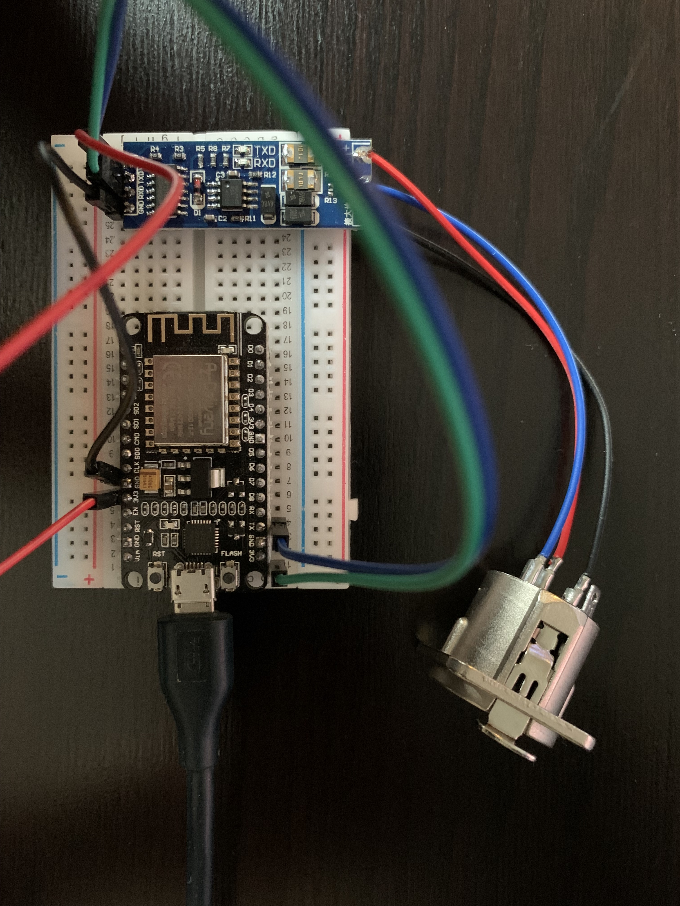

# esp8266_artnet_dmx
Use ESP8266 to receive ArtNet commands via WiFi and output them with TTL to RS485 converter.

I changed the code for outputing the DMX data within the onDmxFrame callback method from the example. It' now done via the espDMX Library which produces more "stable" output and works when youre using a DMX Software which continously sends DMX Data at high frame rates. The code from the "ArtnetnodeWifi" example works when only a few frames are send per second. At higher framerates DMX lights start flickering and behaving weird ;).

## This project uses the following Libraries / other Projects:
https://github.com/rstephan/ArtnetnodeWifi \
https://github.com/mtongnz/espDMX

Note that the green wire connected to the RXD pin of the TTL to RS485 converter board is not conected to the ESP8266. It'splugged in to a free/empty rail of the breadboard. For only sending out DMX only connecting TX is sufficient.
Furthermore note that the RXD pin of this specific TTL to RS485 board has to be connected to TX pin of the ESP8266, TXD has to be connected to RX. When using other TTL to RS485 board the TX of the ESP may has to be connected to the RX pin of the TTL board.
